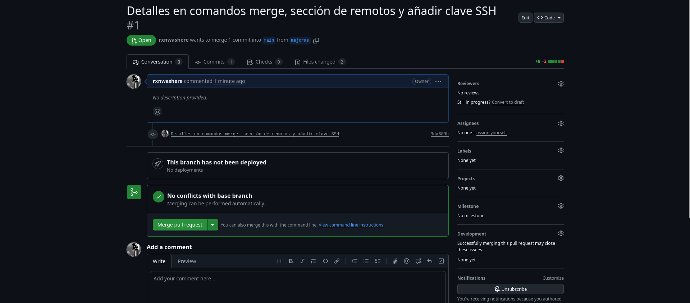
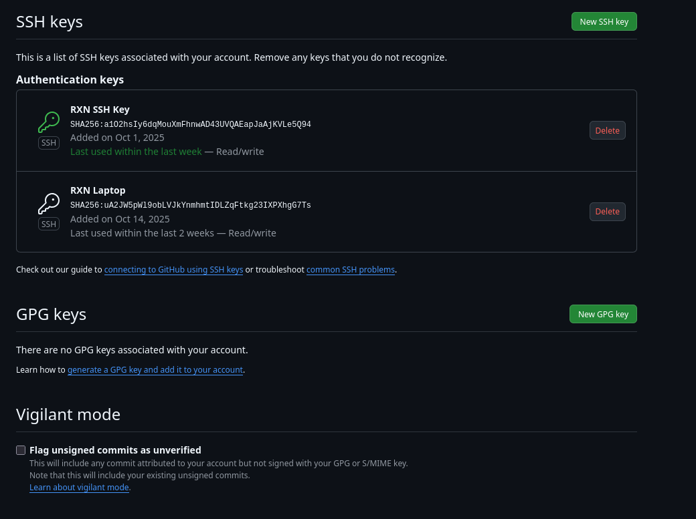

# [🧠 Apuntes de **Git** y **GitHub**](https://rxnwashere.github.io/rxnwashere_apuntes_git/)

## 📑 Contenidos

1. [🧩 ¿Qué es Git?](#que-es-git)  
2. [🔄 Ciclo de vida de los archivos en Git](#ciclo-de-vida-de-los-archivos-en-git)  
   - [📊 Fases principales](#fases-principales)  
3. [⚙️ Configuración inicial](#configuracion-inicial)  
4. [🗂️ Crear y gestionar repositorios](#crear-y-gestionar-repositorios)  
5. [📁 Flujo de trabajo completo](#flujo-de-trabajo-completo)  
   - [1️⃣ Working Directory → Staging Area](#working-directory--staging-area)  
   - [2️⃣ Staging Area → Repository (commit)](#staging-area--repository-commit)  
   - [3️⃣ Repository → Remote Repository](#repository--remote-repository)  
   - [4️⃣ Remote Repository → Repository](#remote-repository--repository)  
6. [🪄 Modificar y deshacer cambios](#modificar-y-deshacer-cambios)  
7. [🌿 Ramas (branches)](#ramas-branches)  
8. [☁️ Remotos (GitHub y otros)](#remotos-github-y-otros)  
9. [🔍 Comparar y revisar cambios](#comparar-y-revisar-cambios)  
10. [🔧 Ignorar archivos](#ignorar-archivos)  
11. [💡 Flujo de trabajo típico](#flujo-de-trabajo-típico)  
12. [🧰 Comandos útiles](#comandos-utiles)  
13. [🔐 SSH con GitHub](#ssh-con-github)  
14. [📚 Recursos recomendados](#recursos-recomendados)

---

<a id="que-es-git"></a>
## 🧩 ¿Qué es Git?
**Git** es un sistema de control de versiones distribuido.  
Permite registrar los cambios realizados en un proyecto, volver a versiones anteriores, trabajar en equipo y fusionar código fácilmente.

---

<a id="ciclo-de-vida-de-los-archivos-en-git"></a>
## 🔄 Ciclo de vida de los archivos en Git

Git maneja **cuatro estados principales** en los que puede estar un archivo:

| Estado | Descripción |
|--------|--------------|
| **Untracked** | El archivo existe en tu carpeta, pero Git no lo está controlando. |
| **Tracked** | El archivo ya fue añadido al control de versiones. |
| **Staged** | El archivo ha sido preparado para el siguiente commit (`git add`). |
| **Committed** | El archivo ya está guardado en la base de datos de Git (`git commit`). |

<a id="fases-principales"></a>
### 📊 Fases principales

```
[ Working Directory ] → git add → [ Staging Area ] → git commit → [ Local Repository ] → git push → [ Remote Repository (GitHub) ]
```

- **Working Directory**: tus archivos reales.
- **Staging Area** (o **index**): una “zona intermedia” donde eliges qué cambios se guardarán en el próximo commit.
- **Local Repository**: historial de commits en tu máquina.
- **Remote Repository**: copia del repo en un servidor (GitHub, GitLab, etc.).

---

<a id="configuracion-inicial"></a>
## ⚙️ Configuración inicial

```bash
git config --global user.name "Tu Nombre"
git config --global user.email "tuemail@example.com"
git config --list
git config --global --edit # Abrir configuración global con editor de texto.
git config --global core.editor "nano" # Configurar editor por defecto (cambia nano por vscode o el editor de tu elección)
```

---

<a id="crear-y-gestionar-repositorios"></a>
## 🗂️ Crear y gestionar repositorios

```bash
git init                      # Inicia un nuevo repositorio en la carpeta actual
git clone <URL>               # Clona un repositorio existente (de GitHub u otro servidor)
```

---

<a id="flujo-de-trabajo-completo"></a>
## 📁 Flujo de trabajo completo

<a id="working-directory--staging-area"></a>
### 1️⃣ Working Directory → Staging Area
Añadimos archivos a la zona de preparación.

```bash
git add <archivo>             # Añadir un archivo
git add .                     # Añadir todos los cambios
git status                    # Ver el estado actual de los archivos en el repositorio
```

<a id="staging-area--repository-commit"></a>
### 2️⃣ Staging Area → Repository (commit)
Guardamos los cambios en la base de datos local de Git.

```bash
git commit -m "Mensaje del commit"   # Confirmar los cambios preparados. También podemos hacer git commit sin el parámetro -m, pero en lugar de hacer el commit con el mensaje directamente nos abrirá el editor por defecto que hayamos configurado.
```

<a id="repository--remote-repository"></a>
### 3️⃣ Repository → Remote Repository
Subimos nuestros commits al servidor remoto (GitHub).

```bash
git push origin main                 # Subir cambios a la rama main
git push --set-upstream origin main  # Primera vez, vincula la rama local con la remota
```

<a id="remote-repository--repository"></a>
### 4️⃣ Remote Repository → Repository
Descargamos o actualizamos los cambios remotos.

```bash
git pull origin main                 # Descargar y fusionar cambios
git fetch                            # Descargar sin fusionar (solo actualiza la info remota)
```

En caso que el repositorio remoto este "1 commit behind" del repositorio local (Siguiente ejemplo);

```bash
origin/main:  A --- B --- C   # Commits repositorio remoto
local/main:   A --- B --- D   # Commits repositorio local
```

Si hacemos "git pull" git no va a preguntar cómo queremos fusionar los cambios, tenemos dos opciones:

1 - Crear un "merge commit" que combina el repositorio local con el repositorio remoto. 

```bash
git pull --no-rebase
          D         # Commits repositorio local
         /
A --- B --- C       # Commits repositorio remoto
         \
          M  (merge commit)  # Nuevo merge commit

```

**Pros**: No se modifican los commits, seguro para ramas compartidas.  
**Cons**: Crea "merge commits" adicionales, el historial puede parecer más caótico.

2 - Git fusiona los cambios y crea un nuevo commit, haciendo el historial lineal.

```bash
git pull --rebase

A --- B --- C --- D    # D es el commit local, "rebased" con C
```

**Pros**: Limpio, historial lineal, fácil de leer.  
**Cons**: Reescribe los ID's de los commits, no es seguro para ramas compartidas. 

Si no queremos que git nos avise cada vez que nos encontramos en esta situación, podemos configurar el comportamiento por defecto:

```bash
git config pull.rebase false   # Hacer siempre merge
git config pull.rebase true    # Hacer siempre rebase
```

---

<a id="modificar-y-deshacer-cambios"></a>
## 🪄 Modificar y deshacer cambios

```bash
git restore --staged <archivo>   # Quitar un archivo del área de stage
git restore <archivo>            # Deshacer cambios en el working directory
git revert <id_commit>           # Crear un commit que revierta otro
git reset --hard <id_commit>     # Volver el repo a un commit anterior (borra cambios)
```

---

<a id="ramas-branches"></a>
## 🌿 Ramas (branches)

```bash
git branch                       # Ver ramas

git branch <nombre>              # Crear una rama

git switch <nombre>              # Cambiar de rama
git checkout <nombre>

git switch -c <nombre>           # Crear y cambiar a la vez
git checkout -b <nombre>

git merge <nombre>               # Fusionar una rama con la actual. No genera commit de merge, solo mueve el puntero de la rama hacia delante
git merge <nombre> --no-ff       # Fusiona una rama con la actual pero forzando dejar un commit de merge. --no-ff significa "No fast forward".
git merge <nombre> --allow-unrelated-histories # Fusionar una rama sin cambios relacionados con la actual
git branch -d <nombre>           # Borrar una rama
```

---

<a id="remotos-github-y-otros"></a>
## ☁️ Remotos (GitHub y otros)

```bash
git remote add origin <URL HTTP> / <URL SSH> # Conectar el repo local a uno remoto
git remote -v                    # Ver los remotos configurados
git push                         # Subir cambios
git pull                         # Bajar y fusionar cambios
git fetch                        # Descargar sin fusionar
```

---

<a id="comparar-y-revisar-cambios"></a>
## 🔍 Comparar y revisar cambios

```bash
git diff                         # Ver diferencias entre archivos
git diff <commit1> <commit2>     # Comparar commits
git log --oneline --graph --all  # Ver el historial con ramas
git blame <archivo>              # Ver quién cambió cada línea
```

---

<a id="ignorar-archivos"></a>
## 🔧 Ignorar archivos

Archivo `.gitignore`:
```
# Carpetas
node_modules/
dist/

# Archivos temporales
*.log
.env
```

---

<a id="flujo-de-trabajo-típico"></a>
## 💡 Flujo de trabajo típico

```bash
git clone <url>
git checkout -b feature/nueva-funcionalidad
# (editar archivos)
git add .
git commit -m "Añadida nueva funcionalidad"
git push origin feature/nueva-funcionalidad
# Crear Pull Request en GitHub
```

**EJEMPLO DE PULL REQUEST:**

Cuando entremos a nuestro repositorio desde GitHub a la nueva rama veremos un aviso que nos informará sobre los commits por delante o por detrás que está respecto a <code>main</code>, para este ejemplo estará un commit por delante.

También veremos una notificación avisando de las ramas que han tenido pushes recientemente:


Presionaremos <code>Compare & Pull Request</code> para comprobar los cambios y fusionar ambas ramas:


Añadimos un nombre a nuestra request (puede coger el nombre de nuestro último commit en la rama a fusionar):


Si nos fijamos arriba podremos observar que nos informa que está listo para fusionar automáticamente debido a que no hay conflictos 
(<code>Able to merge</code>)

Al abrir la pull request si no hay conflictos como en este caso podremos hacer un <code>merge</code> con main:




Cuando se fusione, la pull request será cerrada y podremos eliminar la rama si lo deseamos:


---

<a id="comandos-utiles"></a>
## 🧰 Comandos útiles

```bash
git log --oneline                # Ver historial corto
git reflog                       # Ver todos los movimientos de HEAD
git clean -f                     # Borrar archivos no rastreados
```

---

<a id="ssh-con-github"></a>
## 🔐 SSH con GitHub

```bash
ssh-keygen -t ed25519 -C "tuemail@example.com"
cat ~/.ssh/id_ed25519.pub
```

Luego añades el contenido de la clave a una nueva desde GitHub, podrás encontrar el menú en:




---

<a id="recursos-recomendados"></a>
## 📚 Recursos recomendados

- [Pro Git Book (en español)](https://git-scm.com/book/es/v2)
- [Git Cheatsheet (GitHub)](https://education.github.com/git-cheat-sheet-education.pdf)
- [Learn Git Branching (interactivo)](https://learngitbranching.js.org/)
- [Documentación oficial de Git](https://git-scm.com/docs)

<br>

<code>Hecho por Aarón Cano ([rxnwashere](https://github.com/rxnwashere)) y revisado con ChatGPT</code>